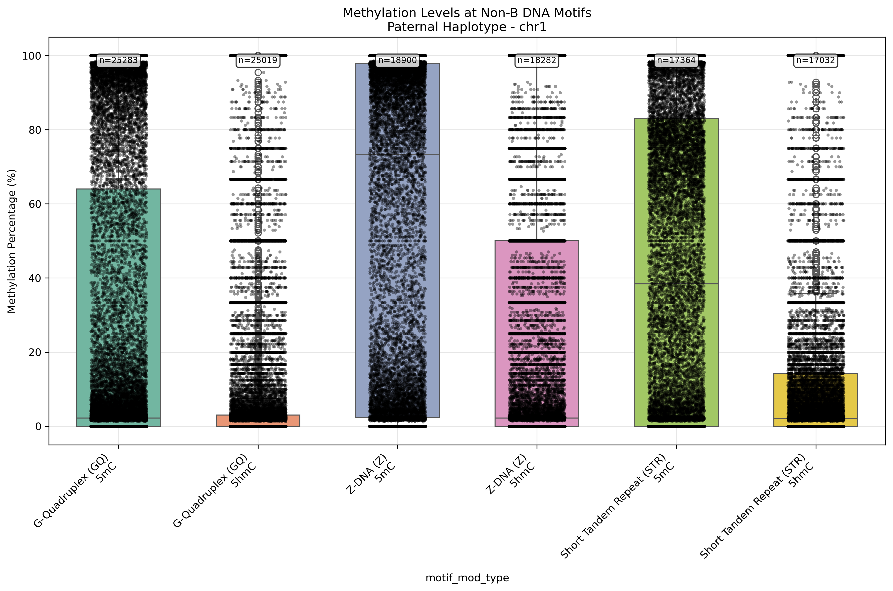
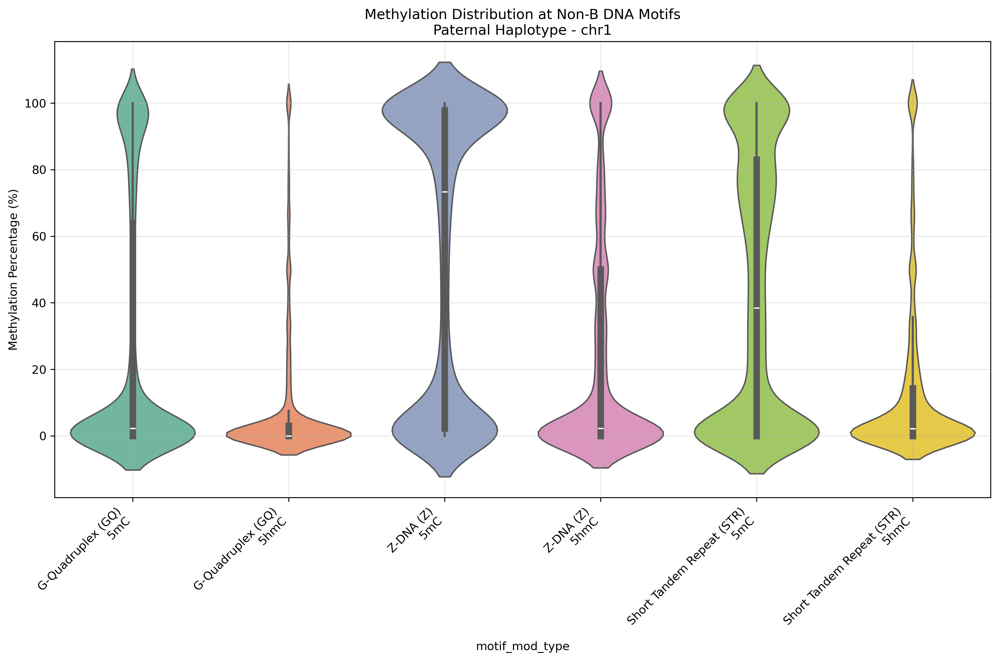
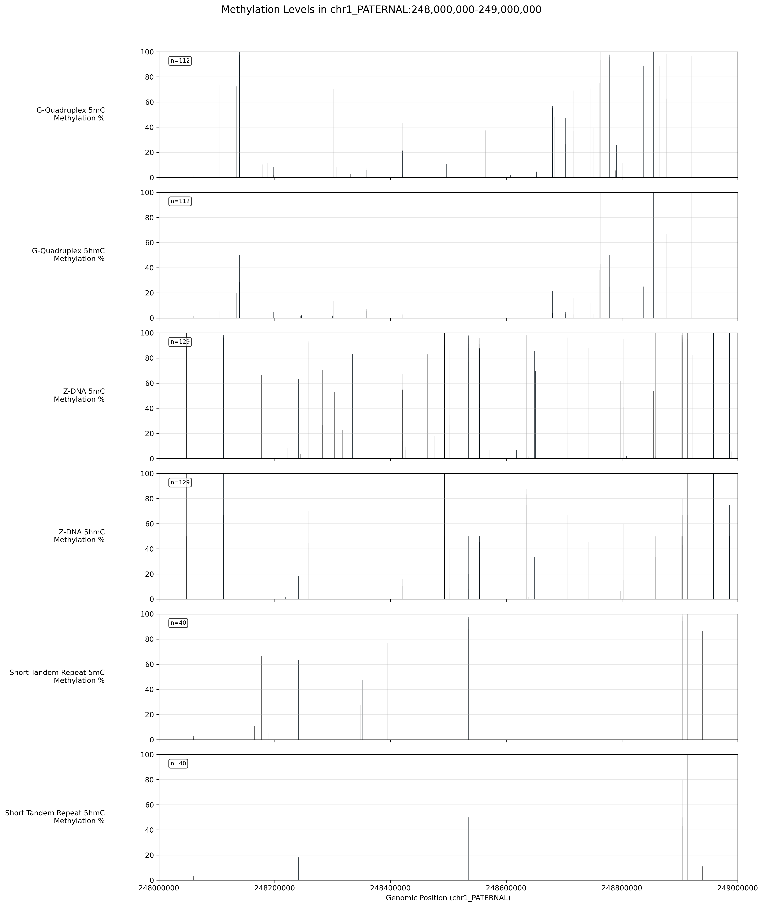

# 🧬 nonB DNA × Methylation Analysis Pipeline

[](https://openwdl.org/)
[](https://cromwell.readthedocs.io/)
[](https://github.com/abcsFrederick/non-B_gfa)

A **Workflow Description Language (WDL)** pipeline to analyze the interplay between **non-B DNA structures** and **DNA methylation patterns**. This pipeline detects various non-B DNA motifs (e.g., G-quadruplexes, Z-DNA, etc.) in a genome and intersects them with methylation data from bedMethyl files to explore potential regulatory relationships.

---

## 📌 Overview

This pipeline performs the following steps:

1. **FASTA Contig Extraction**  
   Splits the input FASTA file and identifies all contigs.

2. **Contig Filtering**  
   Filters contigs based on user-defined patterns (e.g., `chrX`, `all`).

3. **Non-B DNA Motif Detection**  
   Uses **GFA** to detect motifs such as:
   - G-quadruplex (G4/GQ)
   - Z-DNA (Z)
   - Inverted repeats (IR)
   - Mirror repeats (MR)
   - And more…

4. **Methylation Data Intersection**
   - Converts GFF outputs to BED format.
   - Filters bedMethyl files by contig.
   - Intersects motif regions with methylation data using **bedtools**.

---

## 🧱 Requirements

- **Cromwell** (v80+ recommended)  
- **Docker** (for task containerization)  
- **Input files**:
  - Reference FASTA  
  - One or more bedMethyl files (e.g., 5mC, 5hmC)

---

## 🧬 Input Parameters

| Parameter             | Type           | Description |
|----------------------|----------------|-------------|
| `fasta`               | File           | Reference genome FASTA file |
| `contig_filters`      | Array[String]  | List of contigs to process (default: `["all"]`) |
| `motif_classes`       | Array[String]  | Non-B DNA motifs to detect (default: `["G4"]`) |
| `threads`             | Int            | Number of threads for GFA (default: 2) |
| `out_prefix`          | String         | Prefix for output files (default: `"hg002_nonB_meth"`) |
| `extra_gfa_switches`  | String         | Additional flags to pass to GFA |
| `bedmethyl_files`     | Array[File]    | List of bedMethyl files for methylation analysis |

---

## 📥 Example Input JSON

```json
{
  "nonb_methylation_complete_pipeline.fasta": "/path/to/hg002v1.1.fasta",
  "nonb_methylation_complete_pipeline.contig_filters": ["chrX"],
  "nonb_methylation_complete_pipeline.motif_classes": ["Z", "GQ"],
  "nonb_methylation_complete_pipeline.bedmethyl_files": [
    "/path/to/Q100_ONT_5mC.bed",
    "/path/to/Q100_ONT_5hmC.bed"
  ]
}
```

## ▶️ Running the Pipeline

Run using **Cromwell**:

```bash
cromwell run nonB_meth_v5.wdl -i nonB_meth_v4_inputs.json
```

## 📤 Output Files

| Output                  | Description |
|-------------------------|-------------|
| `gff_files`             | GFF files containing detected non-B motifs |
| `tsv_files`             | TSV summaries of motif annotations |
| `bed_files`             | BED files of motif regions |
| `methylation_results`   | BED files of methylation intersected with motifs |
| `processed_contigs`     | List of contigs that were analyzed |
| `workflow_summary`      | Summary string of the run |


## 📊 Visualization Scripts

This repository includes Python scripts for downstream analysis and visualization of methylation patterns at non-B DNA motifs.

### `boxplot_violin.py`

A comprehensive analysis script that generates comparative visualizations of methylation levels across different non-B DNA motifs.

#### Features

- Box plots and violin plots comparing methylation levels  
- Statistical analysis between motif types  
- Summary statistics export to CSV  
- Flexible input handling (individual files or file lists)  
- Automatic motif type detection from filenames  

#### Usage

```bash
python boxplot_violin.py \
    --input-files file1.bed file2.bed file3.bed \
    --output-prefix "motif_analysis" \
    --chromosome "chrX" \
    --haplotype "Maternal" \
    --output-dir "./plots"
```
- **Reference genome:** Human (hg002)  
- **Methylation data:** ONT 5mC and 5hmC  
- **Motif classes:** Z-DNA and G-quadruplex

**Required Python Packages**
```bash
pip install pandas matplotlib seaborn scipy numpy
```
🚀 Getting Started

Run the WDL pipeline to generate intersected methylation files:

These are the *_intersect_*.bed outputs from the workflow.

Use the analysis script to visualize results:

```bash
python boxplot_violin.py --input-files /path/to/intersected/files/*.bed
```

Examples of output plots:





## 🎨 Additional Visualization Scripts

### `plot_region.py`

Creates genome-browser style visualizations showing methylation levels at specific genomic regions.

#### Features

- Genome-browser style plots with rectangular visualization  
- Color-coded by modification type (5mC, 5hmC, G4, Z-DNA, etc.)  
- Automatic color assignment based on filename patterns  
- Sample size annotations  
- Flexible input handling  

#### Usage

```bash
python plot_region.py \
    --bed-files file1.bed file2.bed file3.bed \
    --chromosome "chrX_MATERNAL" \
    --start 1000000 \
    --end 2000000 \
    --output-dir "./region_plots"
```

Examples of output plot:


```

